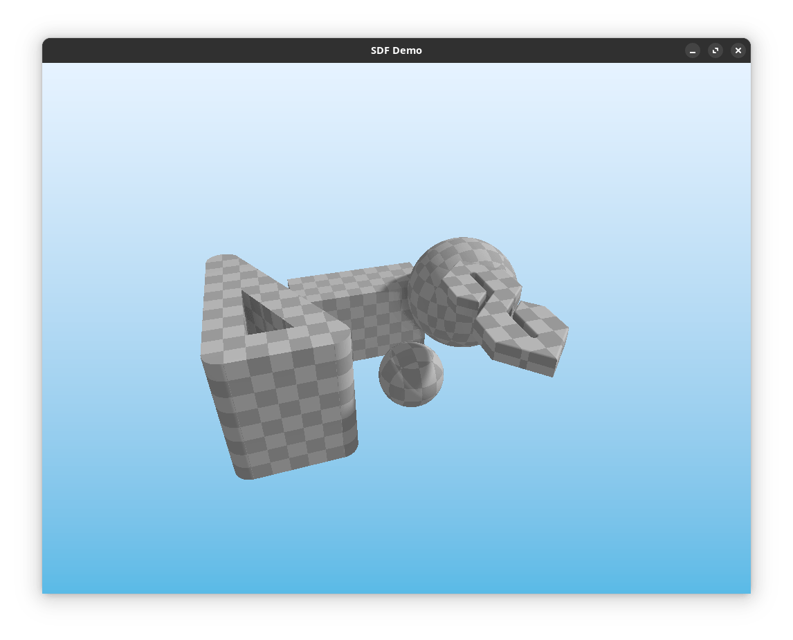
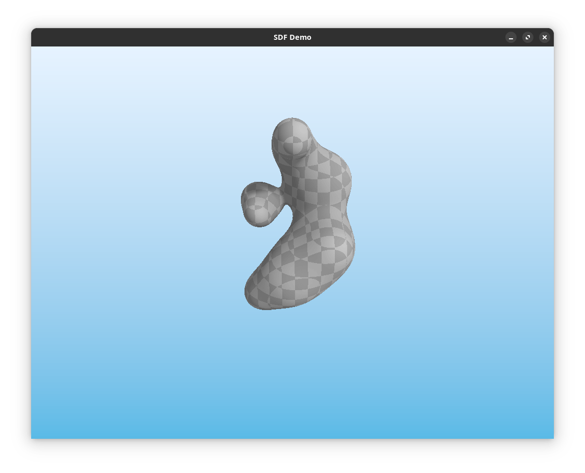
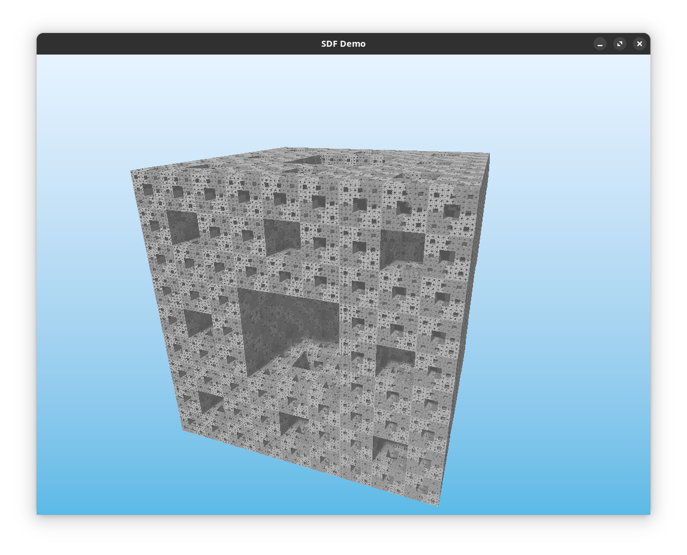
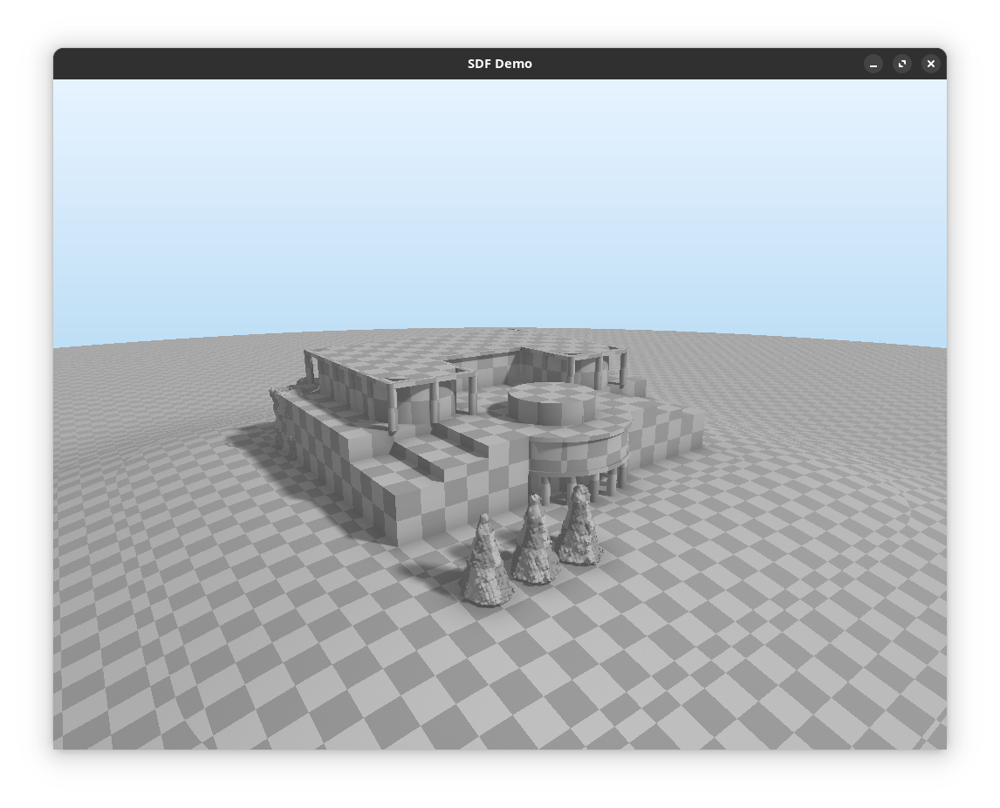
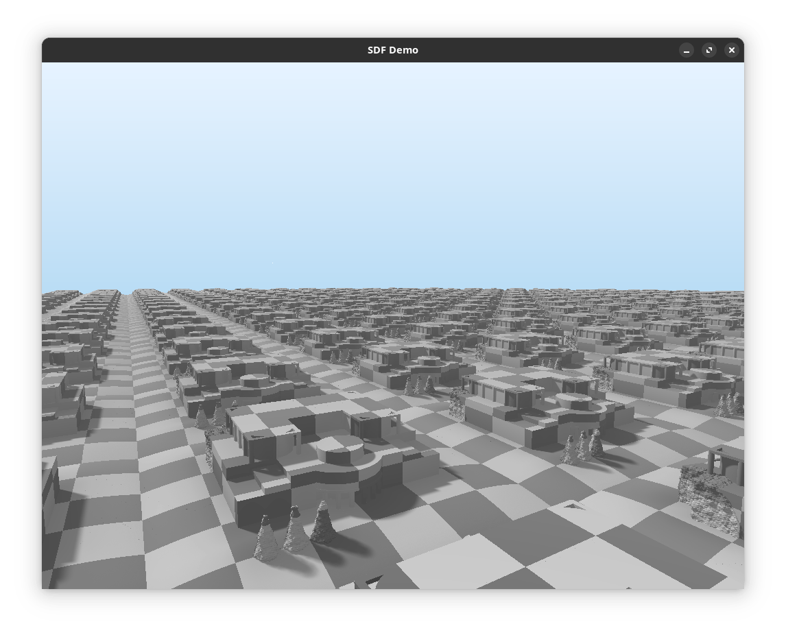

# SDF Demo

A simple SDF demo, based on the work of [Iñigo Quilez](https://iquilezles.org/).

## Building

Requirements: `glew`, `glfw3`, `glm`, build using `cmake`.

```sh
cd build
cmake ..
make
./demo
```

## Scenes (switch with <kbd>S</kbd>)

- Simple scene with few primitives
  
- Metaballs
  
- Menger sponge
  
- [Instytut Informatyki Uniwersytetu Wrocławskiego](https://maps.app.goo.gl/zLTDbTrNz4TE6iaj9)
  
- Instytut Informatyki Uniwersytetu Wrocławskiego (repeated)
  

## Displayed information (switch with <kbd>D</kbd>)

- Combined scene
- Vertical intersection
- Depth
- World position
- Normal vector
- Shading
- Shadows
- Ambient occlusion
- Number of evaluations
